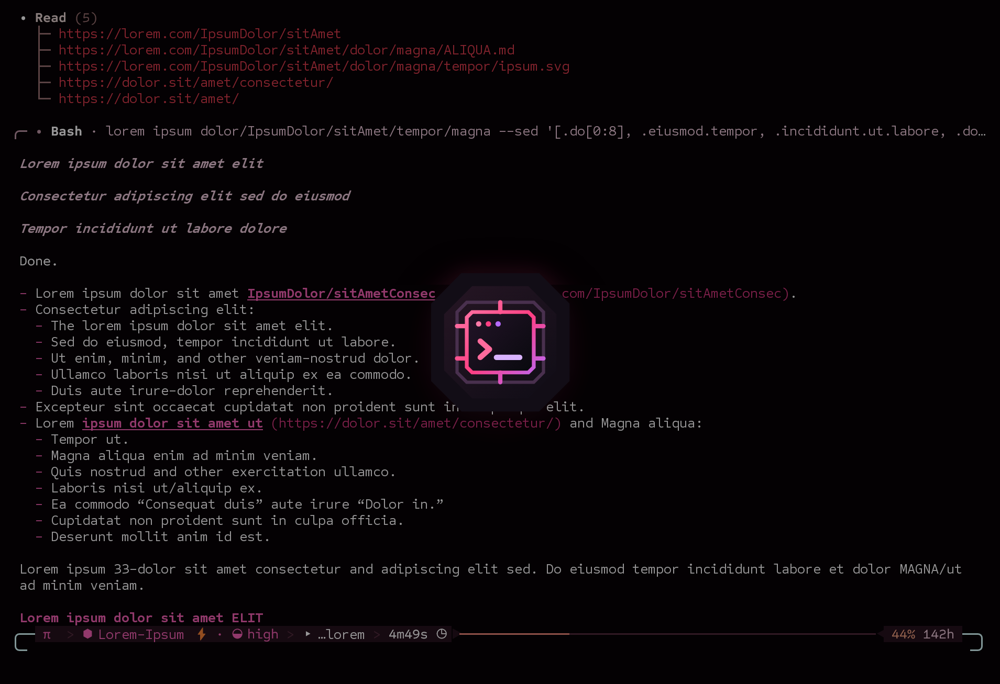
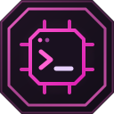

# r7-Harness

r7-Harness is a simplified version of my own agent setup, built on OMP.

I built it because an agent's behavior depends heavily on the environment it runs in, and a better-tuned harness gets much better results.

- Compact layout with session titles, turn timing, usage, status and an input box that stays put
- Task titles with a time estimate, or ✦ for a quick answer
- An optional reply style, on by default: short replies with colored markers and numbered questions, every color can be changed
- Separate profiles for each agent, with their own identity, config, login and sessions
- Global and project instructions, skills, and a few keywords like "update"
- Idle and working themes that change with what the agent is doing (`/theme` to switch), plus a list of good terminal fonts
- It won't change anything until setup checks pass, tools are limited in what they can change, and subagents can't edit the same files
- Stays on one exact OMP version (currently 18.4.4), and it's easy to roll back to an earlier one
- If RTK is installed, common read and test commands go through it for shorter output
- A small optional AutoHotkey script for opening and arranging harness windows in Windows Terminal
- Works with r7-Shell for bigger reply titles, pictures in replies and mouse editing in the input box

## Setup

It runs on WSL with Windows Terminal or r7-Shell. You need git, Python 3 and Bun 1.4.0.

```bash
git clone https://github.com/RyanWheeler7321/r7-Harness.git
cd r7-Harness
curl -L -o omp-18.4.4.tar.gz https://github.com/can1357/oh-my-pi/archive/8ac1309bd8adaddc891eeb389c545345073875be.tar.gz
./install.sh --source omp-18.4.4.tar.gz --agent-name Nova --provider anthropic --model claude-sonnet-5-5
./bin/r7harness launch
```

The install checks the source against `manifest.json`, applies the patch, builds OMP next to any OMP you already have and creates a separate profile. Log in from inside it with `/login`. `./bin/r7harness doctor` checks the install and `./bin/r7harness uninstall --yes` removes the build and the files it installed, and keeps your sessions, login and logs.

To turn the reply style off, set `replyStyle.enabled: false` in the profile's `config.yml`. `replyStyle.colors` changes any of its colors, and the preset lists them all with their defaults.

## Personality

Your agent's personality lives in `PERSONALITY.md` inside its profile (`~/.omp/profiles/r7/agent` by default). Fill it in with what you want to call it, how you want it to behave and how much it should do on its own. Your identity, instructions, credentials, sessions, memory and project details stay on your own machine.

I use it with Codex and Claude, and it works with any other model OMP supports.

It's still early. The install and the main features work, but expect rough edges.

More information: [r7321.art/tools/r7harness](https://r7321.art/tools/r7harness/)

*r7-Harness is an unofficial modification of [OMP](https://github.com/can1357/oh-my-pi). It isn't officially associated with the OMP project, OpenAI/Codex, Anthropic/Claude, or their developers.*
